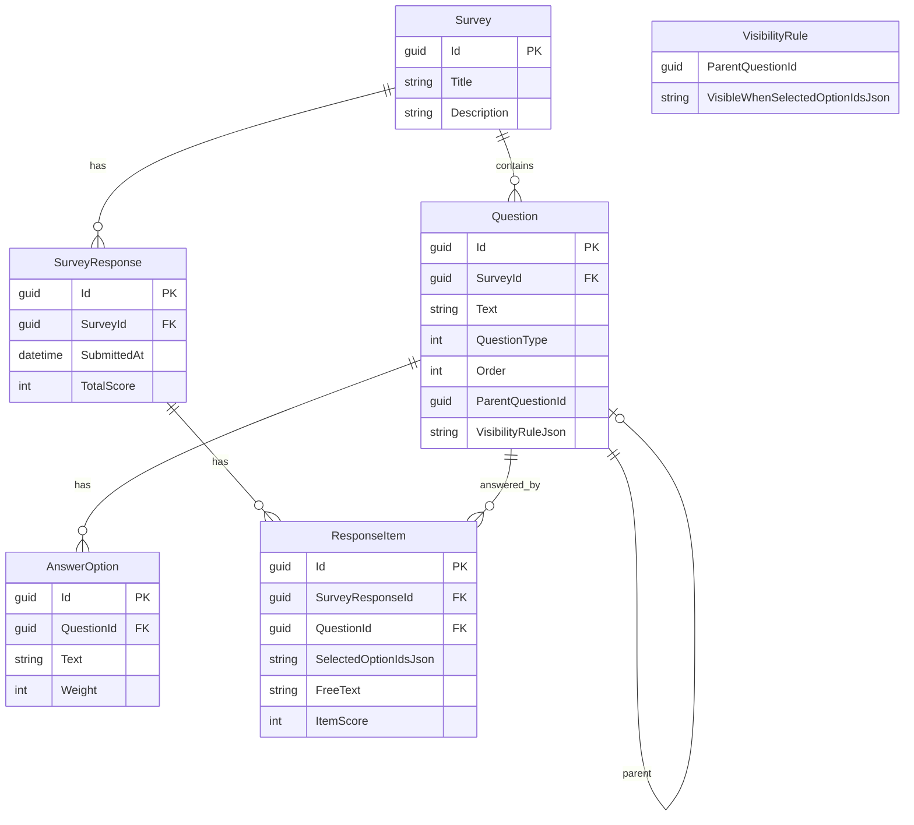

## Data Model Details

### Nullable Fields

- **Survey.Description**: Optional survey description
- **Question.ParentQuestionId**: Only set for conditional questions
- **Question.VisibilityRuleJson**: Only set for conditional questions
- **ResponseItem.SelectedOptionIdsJson**: Only set for choice questions
- **ResponseItem.FreeText**: Only set for free text questions

### JSON Fields

**VisibilityRuleJson (Question table)**

- Stores a JSON serialized `VisibilityRule` object
- Contains `ParentQuestionId` and `VisibleWhenSelectedOptionIds` array
- Used for conditional question display logic
- Nullable - only set for conditional questions

**SelectedOptionIdsJson (ResponseItem table)**

- Stores a JSON serialized array of `Guid` values
- Represents the selected answer option IDs for choice questions
- Empty array for free text questions
- Nullable - only set for choice questions

### Relationships

- **Survey → Questions**: One-to-many with cascade delete
- **Question → AnswerOptions**: One-to-many with cascade delete
- **Survey → SurveyResponses**: One-to-many with cascade delete
- **SurveyResponse → ResponseItems**: One-to-many with cascade delete
- **Question → ResponseItems**: One-to-many (answers reference questions)
- **Question → Question**: Self-referencing for conditional logic (ParentQuestionId)

### Indexes

- Composite index on `(SurveyId, Order)` for efficient question ordering
- Primary keys on all entities for fast lookups
