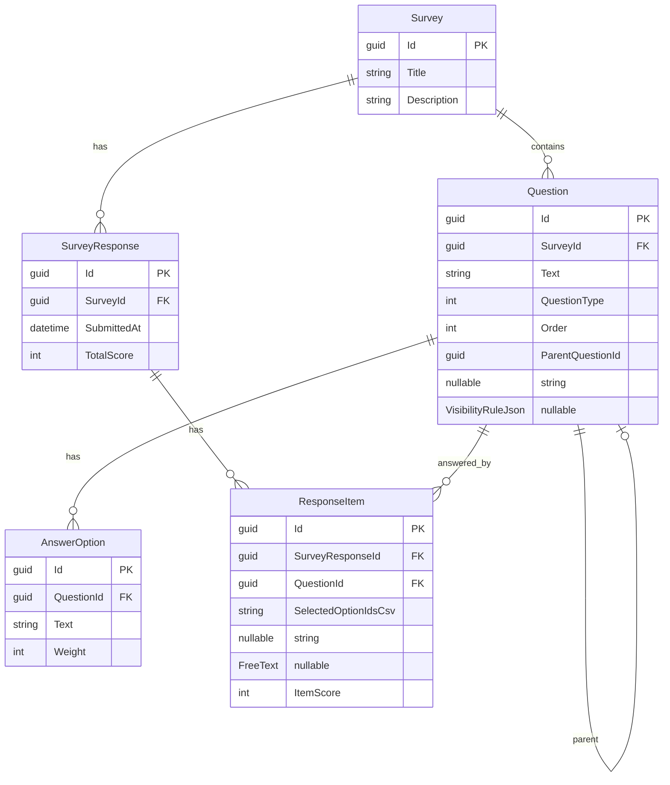

```mermaid
erDiagram
    Survey ||--o{ Question : contains
    Question ||--o{ AnswerOption : has
    Survey ||--o{ SurveyResponse : has
    SurveyResponse ||--o{ ResponseItem : has
    Question ||--o{ ResponseItem : answered_by
    Question ||--o| Question : parent

    Survey {
      guid Id PK
      string Title
      string Description
    }
    Question {
      guid Id PK
      guid SurveyId FK
      string Text
      int QuestionType
      int Order
      guid ParentQuestionId nullable
      string VisibilityRuleJson nullable
    }
    AnswerOption {
      guid Id PK
      guid QuestionId FK
      string Text
      int Weight
    }
    SurveyResponse {
      guid Id PK
      guid SurveyId FK
      datetime SubmittedAt
      int TotalScore
    }
    ResponseItem {
      guid Id PK
      guid SurveyResponseId FK
      guid QuestionId FK
      string SelectedOptionIdsCsv nullable
      string FreeText nullable
      int ItemScore
    }
```
